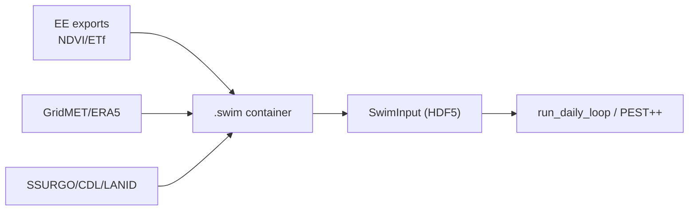

# SWIM-RS

[](https://github.com/dgketchum/swim-rs/actions/workflows/ci.yml)
[](https://codecov.io/gh/dgketchum/swim-rs)

**S**oil **W**ater balance **I**nverse **M**odeling using **R**emote **S**ensing

SWIM-RS combines the desirable qualities of remote sensing and hydrological modeling into an easy-to-use, rigorous
water use modeling system. 

SWIM-RS learns the behavior of the surface by using remote sensing-based estimates of capture-date evapotranspiration.

SWIM-RS is a toolkit for field-scale soil water balance using remote sensing (Landsat/Sentinel NDVI/ETf) and gridded meteorology (GridMET/ERA5) data sources, 
packaged into easy-to-manage containers with provenance and coverage checks. 
The process engine uses numba-accelerated FAO-56 kernels; calibration is field-level via PEST++ IES (ensemble ETf optional). 
A 40-year run on a single field completes in under a second; shipped examples run end-to-end with a few commands.

**The Workflow**

```
swim extract (EE + met) → swim prep (build .swim container) → build_swim_input (HDF5) → run_daily_loop / calibrate
```



## Installation

See the [Installation Guide](docs/installation.md) for detailed setup instructions including conda, PEST++, and Earth Engine authentication.

**Quick install (uv, recommended; Python 3.13):**
```bash
mkdir swim-rs && cd swim-rs
uv init --python 3.13
uv add swimrs

# Calibration requires PEST++ binaries
uv run python -c "import pyemu; pyemu.helpers.get_pestpp_binaries(dest_dir='./bin')"
export PATH="$PWD/bin:$PATH"
```

**Alternative (conda):**
```bash
conda create -n swim python=3.13 -y && conda activate swim
conda install -c conda-forge pestpp geopandas rasterio -y
pip install git+https://github.com/dgketchum/swim-rs.git
```

## Testing

```bash
pip install -e ".[dev]"
pytest

# Coverage (line + branch)
pytest --cov=swimrs --cov-branch --cov-report=term-missing
```

By default, tests requiring Earth Engine auth are skipped; run them with `pytest --run-ee`.

## Quick start (Fort Peck, Montana)

```bash
pip install -e .

# Optional: refresh EE/GridMET (EE sign-up/auth: https://earthengine.google.com/; task manager: https://code.earthengine.google.com/tasks),
# rebuild project shapefile from examples/data. Already included; so --overwrite:
# swim extract examples/2_Fort_Peck/2_Fort_Peck.toml --overwrite

# Build container from shipped data
swim prep examples/2_Fort_Peck/2_Fort_Peck.toml --overwrite

# To run calibration (requires PEST++, ~ min):
swim calibrate examples/2_Fort_Peck/2_Fort_Peck.toml --workers 6 --realizations 20

# Run model and write output CSV
swim evaluate examples/2_Fort_Peck/2_Fort_Peck.toml

# Visualize vs flux tower (saves plots to examples/2_Fort_Peck/)
python examples/2_Fort_Peck/viz.py --results examples/2_Fort_Peck --site US-FPe --save examples/2_Fort_Peck
```

Outputs:
- `examples/2_Fort_Peck/US-FPe.csv` — daily model output
- `examples/2_Fort_Peck/US-FPe_timeseries.png` — ET time series vs flux tower
- `examples/2_Fort_Peck/US-FPe_scatter.png` — scatter plot with R² and RMSE

<!--img-placeholder-->

<!--/img-placeholder-->

SWIM-RS uses remote sensing ET to calibrate a process-based model rather than drive it directly — the result is daily ET
estimates that outperform the satellite retrievals they were trained on. Here, SWIM-RS, *itself calibrated on PT-JPL*, achieves
R² = 0.68 vs PT-JPL's 0.55 against flux tower observations, a 24% improvement in explained variance.

Further, we automatically get estimates of snow accumulation and melt, groundwater recharge, runoff, and consumption of 
irrigation-applied water (in cases where irrigation is detected, see Example 3 - Crane, OR).

Flux data from [Volk et al., 2023](https://www.sciencedirect.com/science/article/pii/S0168192323000011).

## Scientific and Software Highlights

### Scientific Innovation

- **Unified Framework Combining Remote Sensing Coverage with Hydrologic Process Fidelity** — Bridges the spatial coverage and observational power of satellite data with the temporal and physical rigor of process-based soil water balance modeling, enabling field-scale estimation of ET, soil moisture, and irrigation dynamics.

- **Seamless Fusion of Remote Sensing and Water Balance Simulation** — Dynamically integrates NDVI (Landsat, Sentinel-2) and ET fraction (OpenET/PT-JPL, SSEBop, SIMS) into a FAO-56 dual crop coefficient framework, allowing remote sensing to inform both transpiration and evaporation components on a daily basis.

- **OpenET Ensemble Integration for Calibration and Benchmarking** — Uses multimodel, open source OpenET ensemble members (PT-JPL, SSEBop, SIMS, geeSEBAL) for calibration targets and evaluation metrics, supporting robust comparison across algorithms and against ground truth.

- **Flexible Workflows: Irrigation Classification or LULC-Only Modes** — Supports both irrigation-mask workflows (e.g., via LANID/IrrMapper in CONUS) and non-mask modes suitable for international contexts using only land cover and NDVI time series.

- **Physically-Bounded Kernels for Hydrologic Processes** — Implements all major components (snowmelt, infiltration, runoff via curve number and infiltration excess, root dynamics, evaporation, and transpiration) using physically consistent and testable numerical kernels.

- **Validation Across 160+ Flux Tower Sites** — Field-scale results benchmarked against observed ET from eddy covariance towers, with daily and monthly comparisons to SSEBop and OpenET ensembles. RMSE and R² logged per site/month with automatic diagnostics.

### Modern Scientific Software Architecture

- **Container-Based Data Management with Built-In Provenance** — All inputs (remote sensing, met, soils, snow, derived features) are stored in a single Zarr-based `.swim` file, with audit logging, coverage tracking, and spatial indexing, enabling traceable and reproducible modeling workflows.

- **Portable HDF5 Inputs for Simulation and Calibration** — A single HDF5 file (`swim_input.h5`) is generated per project or worker and contains all data needed to run simulations or calibrations independently of the original container or filesystem.

- **Fast, Modular Simulation Engine Using Numba JIT** — Implements core model kernels as Numba-accelerated functions, achieving 5–10× speedups over standard NumPy code and enabling daily simulations over decades for hundreds of fields in seconds.

- **End-to-End Integration with PEST++ IES** — Includes built-in support for spinup, control file generation, localization, and parameter bounds for Iterative Ensemble Smoother–based calibration, directly from container inputs.

- **CLI-Driven Workflow with TOML Configs** — Unified command-line interface (`swim`) supports data extraction, container building, simulation, calibration, and evaluation, all driven by compact and versioned TOML config files.

- **Full Audit Trail and Inventory** — Every ingest and compute step records metadata, input source, time, and affected fields. Combined with inventory validation and xarray-backed data views, this supports complete transparency from source to output.

- **Structured, Extensible, and Tested Codebase** — Test-driven design with explicit deprecation handling, parity checks, and typed dataclasses for state, parameters, and properties. Easily extensible for future snow, ET, or runoff modules or input sources.

## Repository map

- `src/swimrs/container` — Zarr container (ingest/compute/export/query)
- `src/swimrs/process` — Simulation engine, HDF5 `SwimInput`, daily loop
- `src/swimrs/cli.py` — `swim` CLI (extract, prep, calibrate, evaluate, inspect)
- `src/swimrs/calibrate` — PEST++ builders/runners
- `src/swimrs/data_extraction` — Earth Engine + meteorology utilities
- `src/swimrs/swim` — config parsing and legacy helpers
- Deprecated: `src/swimrs/prep`, `src/swimrs/model` (see `DEPRECATION_PLAN.md`)

## Examples

| Example | Description | README |
|---------|-------------|--------|
| **1_Boulder** | End-to-end tutorial demonstrating the SwimContainer API for data ingestion, computation, and model execution using a small study area near Boulder, Montana. Includes 5 notebooks covering container creation, data extraction, ingestion, dynamics computation, and model runs. Works with or without Earth Engine access. | [README](examples/1_Boulder/README.md) |
| **2_Fort_Peck** | Single-site calibration tutorial for the US-FPe flux tower (unirrigated grassland). Demonstrates uncalibrated model runs, PEST++ IES calibration using PT-JPL ETf and SNODAS SWE, and validation against flux tower observations. Shipped data included — no EE required. | [README](examples/2_Fort_Peck/README.md) |
| **3_Crane** | Irrigated site calibration tutorial for an alfalfa field at Crane, Oregon. Similar workflow to Fort Peck but demonstrates irrigation dynamics, crop coefficient calibration, and ensemble ETf targets. | [README](examples/3_Crane/README.md) |
| **4_Flux_Network** | Full CONUS flux network workflow (~160 stations). Production-scale container build, calibration, and evaluation using Landsat NDVI, SSEBop ETf, GridMET, SNODAS, and SSURGO. Includes scripts for group calibration and flux/SSEBop comparisons. | [README](examples/4_Flux_Network/README.md) |
| **5_Flux_Ensemble** | Cropland subset (~60 stations) with OpenET ensemble calibration. Compares SWIM against SSEBop, PT-JPL, and SIMS ensemble targets. Includes OpenET evaluation scripts and cropland filtering utilities. | [README](examples/5_Flux_Ensemble/README.md) |
| **6_Flux_International** | International flux sites using ERA5-Land meteorology, HWSD soils, and Landsat+Sentinel NDVI fusion. Demonstrates non-CONUS workflows with `mask_mode = "none"` and global data sources. | — |

## CLI overview (container-first)

- `swim extract <config.toml>` — Earth Engine + GridMET/ERA5 exports (Drive or bucket)
- `swim prep <config.toml>` — ingest into `.swim`, compute dynamics, export model inputs
- `swim calibrate <config.toml>` — build/run PEST++ IES (requires container)
- `swim evaluate <config.toml>` — debug run, per-site CSVs, optional metrics vs flux/OpenET
- `swim inspect <container.swim>` — container coverage/provenance report

Common flags: `--out-dir` (override project root), `--sites` (restrict IDs), `--workers` (parallel steps), `--add-sentinel`, `--use-lulc-irr` / `--international` (no-mask workflows).

## What it does

- Data extraction (EE): Landsat/Sentinel NDVI, ET fraction from OpenET/USGS-NHM, CDL/LANID irrigation, SSURGO/HWSD, ERA5-Land daily variables. See [Data Extraction Guide](docs/data_extraction.md) for API details.
- Meteorology: GridMET or ERA5-Land daily forcing; optional bias corrections.
- Container compute: merged NDVI, irrigation windows, groundwater subsidy, crop dynamics.
- Modeling: daily SWB with snow, runoff (CN or infiltration-excess), NDVI→Kcb, dynamic Ke/Ks, irrigation scheduling, root growth.
- Calibration: PEST++ IES via pyemu; writes obs/preds and manages worker/master runs.
- Forecasting/analysis/viz: NDVI analog forecasts; metrics vs flux and OpenET; Plotly visualizations.

## Config Schema

Each project uses a TOML with a small, consistent set of keys. These are the required and common optional entries.

- Top level
  - `project` (string): project identifier
  - `root` (string): root directory for resolving paths

- `[paths]` (required)
  - `project_workspace` (string): usually `{root}/{project}`
  - `data` (string): data directory under workspace
  - `landsat`, `landsat_ee_data`, `landsat_tables` (strings)
  - `sentinel`, `sentinel_ee_data`, `sentinel_tables` (strings)
  - `met` (string): GridMET time series directory
  - `gis` (string)
  - `fields_shapefile` (string, REQUIRED): path to a shapefile of fields/polygons
  - `gridmet_mapping` (string, optional): shapefile for precomputed GFID mapping
  - `correction_tifs` (string): folder of monthly correction rasters (ETo/ETr)
  - `gridmet_factors` (string): JSON written by mapping step
  - `properties` (string): directory for properties CSV/JSON
  - `irr`, `ssurgo`, `lulc`, `properties_json` (strings)
  - `snodas_in`, `snodas_out` (strings): SNODAS CSV dir and JSON output
  - `remote_sensing_tables` (string)
  - `joined_timeseries` (string)
  - `dynamics_data` (string)
  - `prepped_input` (string)

- `[earth_engine]` (optional)
  - `fields` (string): EE FeatureCollection asset path (optional; shapefile is used by default)
  - `bucket` (string): optional default Cloud Storage bucket for exports

- `[ids]` (required)
  - `feature_id` (string): field/site identifier column name
  - `gridmet_join_id` (string): ID in `gridmet_mapping` shapefile
  - `state_col` (string, optional): used by irrigation mask logic

- `[misc]` (required)
  - `irrigation_threshold` (float)
  - `elev_units` (string)
  - `refet_type` (string): `eto` or `etr`
  - `runoff_process` (string): `cn` or `ier` (enables NLDAS hours)

- `[date_range]` (required)
  - `start_date`, `end_date` (YYYY-MM-DD)

- `[crop_coefficient]` (required)
  - `kc_proxy` (string)
  - `cover_proxy` (string)

- `[calibration]` (optional, required for calibrate)
  - `pest_run_dir` (string)
  - `etf_target_model` (string)
  - `etf_ensemble_members` (array of strings, optional)
  - `workers` (int), `realizations` (int)
  - `calibration_dir`, `obs_folder`, `initial_values_csv`, `spinup`
  - `python_script` (string, optional): path to a custom forward runner script. Defaults to the packaged script if omitted. Can be overridden via `swim calibrate --python-script`.

- `[forecast]` (optional)
  - `forecast_parameters` (string)

Notes
- Shapefile is the canonical source; when exporting via Earth Engine, the CLI and exporters convert the shapefile to a FeatureCollection under the hood. Providing an EE fields asset is optional and not required for default workflows.

## Configuration

`swimrs.swim.config.ProjectConfig` loads a TOML and resolves path templates (with iterative substitution), sets:
- Paths: project workspace, data subfolders, EE assets, met/RS tables, results, etc.
- IDs/fields: feature IDs, mapping columns.
- Date range, refET type, elevation units, workers/realizations.
- Calibration/forecast parameter sources (CSV/JSON).

See the `examples/` subdirectories for example TOMLs and end-to-end runs.

## Licensing

This software is free and open source under the Apache 2.0 license.

## Dependencies

The software uses third-party libraries subject to their own licenses (e.g., Apache-2.0 in the upstream codebase). Ensure compliance with these dependencies per their terms.

---

Disclaimer: The licensing information is for informational purposes only. Consult the full license texts and seek legal advice for specific questions about licensing or compliance.
