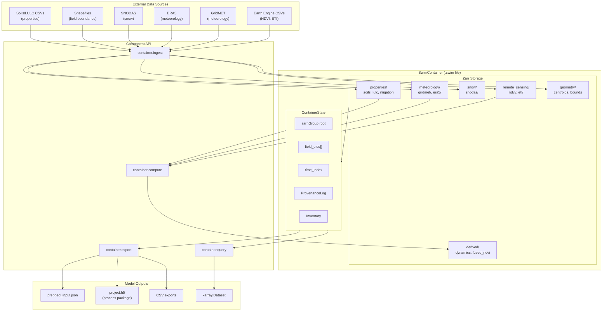
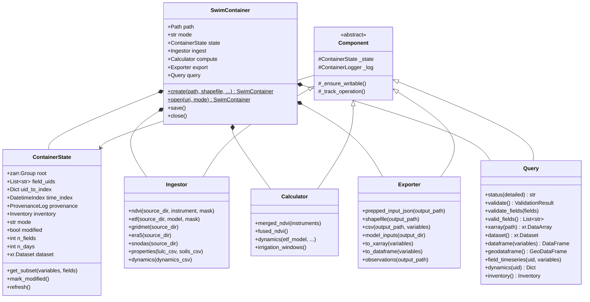
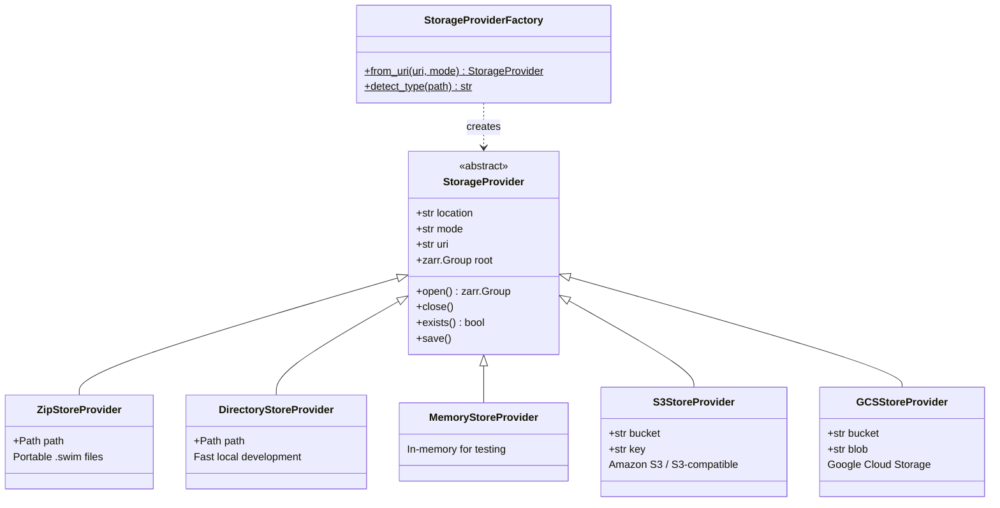
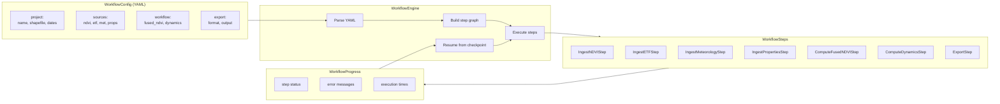
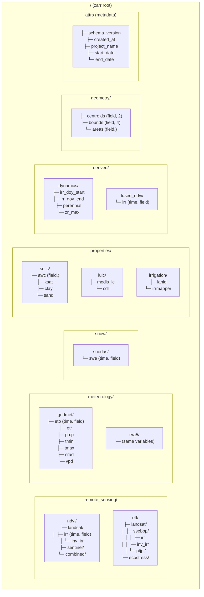
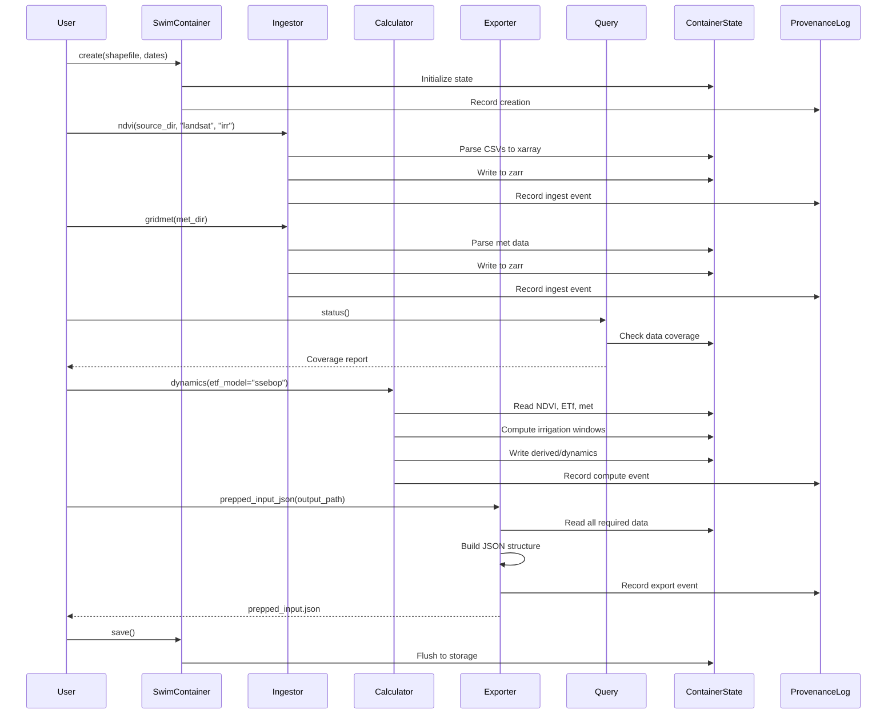

# SwimContainer Architecture

The `swimrs.container` package provides a Zarr-based data container that unifies all SWIM-RS project data in a single `.swim` file. It replaces scattered CSV/JSON/Parquet files with a self-describing archive featuring full provenance tracking.

## Package Structure

```
src/swimrs/container/
├── __init__.py           # Public API exports
├── container.py          # SwimContainer main class
├── state.py              # ContainerState: centralized state + xarray interface
├── schema.py             # Data schema definitions and enums
├── provenance.py         # Audit trail for all operations
├── inventory.py          # Coverage tracking and validation
├── metrics.py            # Operation performance metrics
├── logging.py            # Structured JSON logging
├── components/           # Functional component classes
│   ├── base.py           # Component base class
│   ├── ingestor.py       # Data ingestion
│   ├── calculator.py     # Derived computations
│   ├── exporter.py       # Export to model formats
│   └── query.py          # Data access and status
├── storage/              # Pluggable storage backends
│   ├── base.py           # StorageProvider interface
│   ├── local.py          # ZipStore, DirectoryStore, MemoryStore
│   ├── cloud.py          # S3, GCS providers
│   └── factory.py        # URI-based provider selection
└── workflow/             # Multi-step workflow orchestration
    ├── config.py         # YAML configuration parsing
    ├── steps.py          # Workflow step definitions
    └── engine.py         # Workflow execution engine
```

---

## Core Classes

The container package uses a main container class with four functional
components that share a common state object.

### SwimContainer

The top-level class that represents a `.swim` file. It provides factory
methods (`create()`, `open()`) and delegates work to its component objects.
Opening a container in read mode (`'r'`) prevents modifications; write mode
(`'r+'`) allows updates. The container manages the storage backend lifecycle
and coordinates saves.

### ContainerState

Centralized state shared by all components. It holds the zarr root group,
field UIDs, time index, provenance log, and inventory tracker. Provides an
xarray Dataset view of the data for vectorized operations. Components read
and write through this object to maintain consistency.

### Ingestor (`container.ingest`)

Handles data ingestion from external sources. Methods like `ndvi()`,
`gridmet()`, `snodas()`, and `properties()` parse source files (CSVs,
NetCDFs) and write them to the appropriate zarr paths. Each ingest operation
records its source, parameters, and timestamp in the provenance log.

### Calculator (`container.compute`)

Performs derived computations on ingested data. Examples: merging NDVI from
multiple instruments (`merged_ndvi()`), fusing NDVI time series
(`fused_ndvi()`), and computing irrigation windows and crop dynamics
(`dynamics()`). Results are written to `derived/` paths in the container.

### Exporter (`container.export`)

Exports container data to formats needed by downstream tools. Key method
`prepped_input_json()` produces the JSON file consumed by the process
package. Also supports CSV exports, shapefiles, and direct conversion to
xarray Datasets or pandas DataFrames.

### Query (`container.query`)

Read-only data access and validation. The `status()` method reports data
coverage; `validate()` checks for missing or invalid data. Provides
`xarray()`, `dataframe()`, and `geodataframe()` methods for extracting
subsets. Used to inspect container contents without modification.

---

## Data Flow Diagram

Shows how data flows from external sources through ingestion, computation,
and export.



---

## Class Relationships

Shows the main classes and their relationships.



---

## Storage Backend Architecture

Shows the pluggable storage provider system.



---

## Workflow Engine

Shows the YAML-driven workflow orchestration system.



---

## Zarr Data Schema

Shows the hierarchical data organization within the container.



---

## Component Operation Sequence

Shows a typical workflow sequence from container creation to export.



---

## Key Design Decisions

### Zarr Backend
- **Single-file packaging**: ZipStore creates portable `.swim` files
- **Lazy loading**: Time series loaded on-demand, not all at once
- **Cloud-ready**: Same API works with S3/GCS backends

### Component Architecture
- **Separation of concerns**: Ingest, Compute, Export, Query are independent
- **Shared state**: All components access `ContainerState` for consistency
- **IDE-friendly**: `container.ingest.ndvi()` provides autocomplete

### Provenance Tracking
- **Full audit trail**: Every operation recorded with timestamps
- **Reproducibility**: Parameters and sources captured
- **Debugging**: Can trace data lineage through operations

### xarray Integration
- **Vectorized operations**: Efficient computation over fields × time
- **Familiar API**: Scientists know xarray/pandas
- **Memory efficient**: Dask integration for large datasets

### Schema Enums
- **Type safety**: `Instrument.LANDSAT` vs string typos
- **Discoverability**: IDE shows valid options
- **Validation**: Invalid combinations caught early
