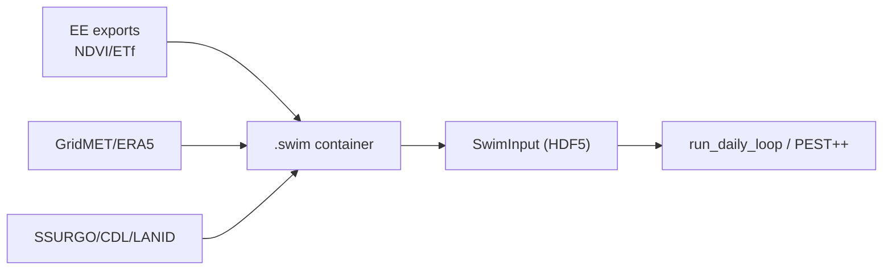

# SWIM-RS

**S**oil **W**ater balance **I**nverse **M**odeling using **R**emote **S**ensing

SWIM-RS combines the desirable qualities of remote sensing and hydrological modeling into an easy-to-use, rigorous water use modeling system.

SWIM-RS is a container-first toolkit for field-scale soil water balance: Landsat/Sentinel NDVI/ETf + GridMET/ERA5 meteorology, packaged into `.swim` containers with provenance and coverage checks. The process engine uses numba-accelerated FAO-56 kernels; calibration is field-level via PEST++ IES (ensemble ETf optional). A 40-year run on a single field completes in under a second; shipped examples run end-to-end with a few commands.

**What you get**

- Per-field ET and irrigation diagnostics from fused RS + met forcing
- Containerized data with provenance/coverage checks for reproducible runs
- PEST++-calibrated parameters and fast kernels (ensemble ETf optional)

## Modern workflow (container-first)

```
swim extract (EE + met) → swim prep (build .swim container) → build_swim_input (HDF5) → run_daily_loop / calibrate
```

The legacy `prep/` and `model/` packages are deprecated; the container (`swimrs.container`) plus process engine (`swimrs.process`) are the canonical path. `prepped_input.json` is retained for compatibility.



## Installation

See the [Installation Guide](installation.md) for detailed setup instructions including conda, PEST++, and Earth Engine authentication.

**Quick install** (assumes conda and Python 3.11+):
```bash
conda create -n swim python=3.11 -y && conda activate swim
conda install -c conda-forge pestpp geopandas rasterio -y
pip install git+https://github.com/dgketchum/swim-rs.git
```

## Quick start (Fort Peck, Montana)

```bash
pip install -e .

# Build container from shipped data
swim prep examples/2_Fort_Peck/2_Fort_Peck.toml --overwrite

# Run model and write output CSV
swim evaluate examples/2_Fort_Peck/2_Fort_Peck.toml

# To run calibration (requires PEST++):
swim calibrate examples/2_Fort_Peck/2_Fort_Peck.toml --workers 6 --realizations 20

# Visualize SWIM-RS against the PT-JPL remote sensing ET model
python examples/2_Fort_Peck/viz.py --results examples/2_Fort_Peck --site US-FPe --save examples/2_Fort_Peck
```

Outputs:

- `examples/2_Fort_Peck/US-FPe.csv` — daily model output
- `examples/2_Fort_Peck/US-FPe_timeseries.png` — ET time series vs flux tower
- `examples/2_Fort_Peck/US-FPe_scatter.png` — scatter plot with R² and RMSE


SWIM-RS uses remote sensing ET to calibrate a process-based model rather than drive it directly — the result is daily ET estimates that outperform the satellite retrievals they were trained on. Here, SWIM-RS *calibrated on PT-JPL* achieves R² = 0.63 vs PT-JPL's 0.55 against flux tower observations.

Flux data from [Volk et al., 2023](https://www.sciencedirect.com/science/article/pii/S0168192323000011).

## Scientific and Software Innovations

### Scientific Innovation

- **Unified Framework Combining Remote Sensing Coverage with Hydrologic Process Fidelity** — Bridges the spatial coverage and observational power of satellite data with the temporal and physical rigor of process-based soil water balance modeling, enabling field-scale estimation of ET, soil moisture, and irrigation dynamics.

- **Seamless Fusion of Remote Sensing and Water Balance Simulation** — Dynamically integrates NDVI (Landsat, Sentinel-2) and ET fraction (OpenET/PT-JPL, SSEBop, SIMS) into a FAO-56 dual crop coefficient framework, allowing remote sensing to inform both transpiration and evaporation components on a daily basis.

- **OpenET Ensemble Integration for Calibration and Benchmarking** — Uses multimodel, open source OpenET ensemble members (PT-JPL, SSEBop, SIMS, geeSEBAL) for calibration targets and evaluation metrics, supporting robust comparison across algorithms and against ground truth.

- **Flexible Workflows: Irrigation Classification or LULC-Only Modes** — Supports both irrigation-mask workflows (e.g., via LANID/IrrMapper in CONUS) and non-mask modes suitable for international contexts using only land cover and NDVI time series.

- **Physically-Bounded Kernels for Hydrologic Processes** — Implements all major components (snowmelt, infiltration, runoff via curve number and infiltration excess, root dynamics, evaporation, and transpiration) using physically consistent and testable numerical kernels.

- **Validation Across 160+ Flux Tower Sites** — Field-scale results benchmarked against observed ET from eddy covariance towers, with daily and monthly comparisons to SSEBop and OpenET ensembles. RMSE and R² logged per site/month with automatic diagnostics.

### Modern Scientific Software Architecture

- **Container-Based Data Management with Built-In Provenance** — All inputs (remote sensing, met, soils, snow, derived features) are stored in a single Zarr-based `.swim` file, with audit logging, coverage tracking, and spatial indexing, enabling traceable and reproducible modeling workflows.

- **Portable HDF5 Inputs for Simulation and Calibration** — A single HDF5 file (`swim_input.h5`) is generated per project or worker and contains all data needed to run simulations or calibrations independently of the original container or filesystem.

- **Fast, Modular Simulation Engine Using Numba JIT** — Implements core model kernels as Numba-accelerated functions, achieving 5–10× speedups over standard NumPy code and enabling daily simulations over decades for thousands of fields in seconds.

- **End-to-End Integration with PEST++ IES** — Includes built-in support for spinup, control file generation, localization, and parameter bounds for Iterative Ensemble Smoother–based calibration, directly from container inputs.

- **CLI-Driven Workflow with TOML Configs** — Unified command-line interface (`swim`) supports data extraction, container building, simulation, calibration, and evaluation, all driven by compact and versioned TOML config files.

- **Full Audit Trail and Inventory** — Every ingest and compute step records metadata, input source, time, and affected fields. Combined with inventory validation and xarray-backed data views, this supports complete transparency from source to output.

- **Structured, Extensible, and Tested Codebase** — Test-driven design with explicit deprecation handling, parity checks, and typed dataclasses for state, parameters, and properties. Easily extensible for future snow, ET, or runoff modules or input sources.

## Links

- [GitHub](https://github.com/dgketchum/swim-rs)
- [Installation Guide](installation.md)
- [Data Extraction Guide](data_extraction.md)
- [CLI Cheat Sheet](swim_cli_cheatsheet.md)
- License: CC-BY-NC-4.0
