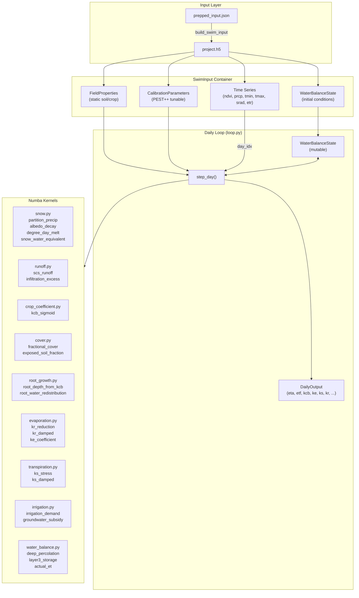
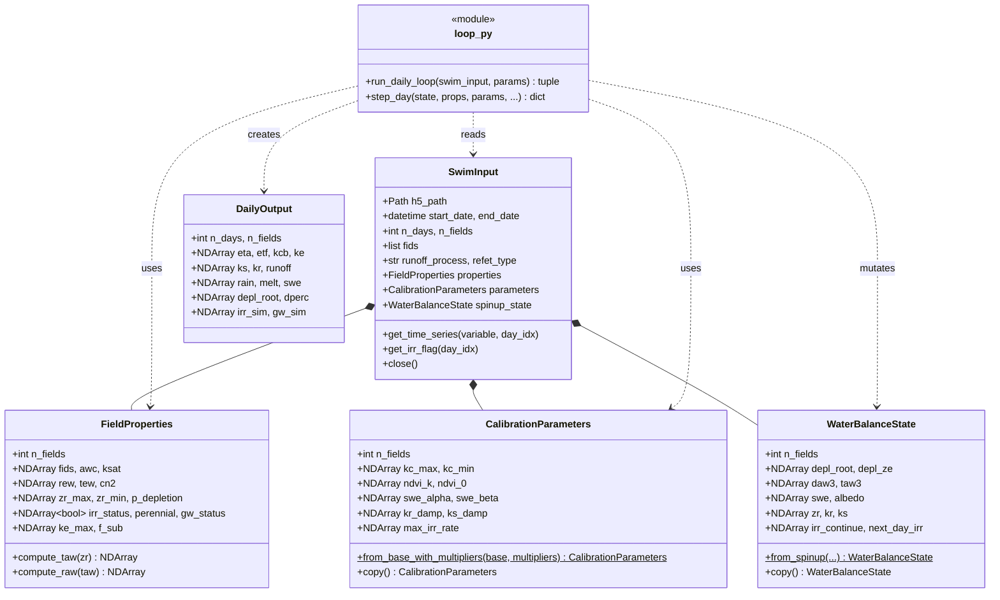
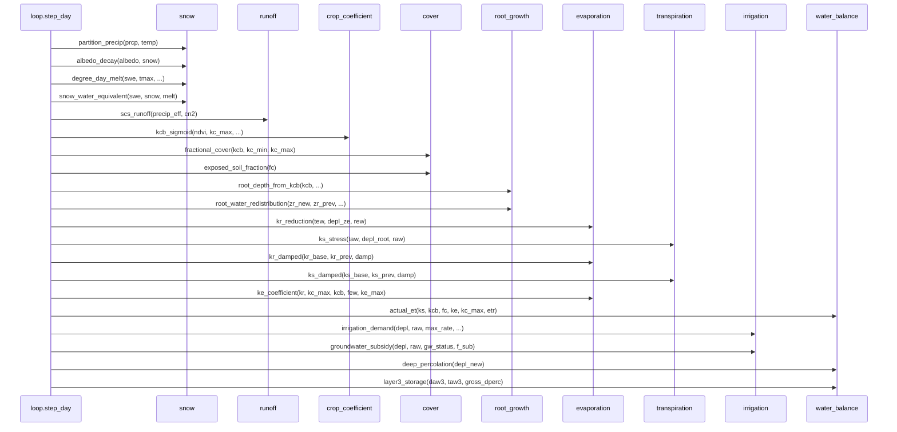

# Process Package Architecture

The `swimrs.process` package provides a restructured, high-performance implementation of the SWIM-RS water balance model using typed dataclasses and Numba-compiled kernels.

## Package Structure

```
src/swimrs/process/
├── __init__.py
├── input.py          # SwimInput: HDF5-backed data container
├── state.py          # Dataclasses: WaterBalanceState, FieldProperties, CalibrationParameters
├── loop.py           # Daily simulation loop orchestration
└── kernels/          # Numba-compiled physics functions
    ├── cover.py
    ├── crop_coefficient.py
    ├── evaporation.py
    ├── irrigation.py
    ├── root_growth.py
    ├── runoff.py
    ├── snow.py
    ├── transpiration.py
    └── water_balance.py
```

---

## Core Dataclasses

The process package uses five main dataclasses to organize simulation data.
All array attributes have shape `(n_fields,)` unless otherwise noted.

### SwimInput

The top-level container that packages everything needed for a simulation run.
It wraps an HDF5 file and provides lazy access to time series data. We build
it once from `prepped_input.json` and distribute the resulting `.h5` file to
PEST++ workers. It holds references to the three dataclasses below plus
methods to retrieve daily forcing data by index.

### FieldProperties

Static soil and crop properties that do not change during simulation. These
come from soil surveys (AWC, Ksat), land cover databases (root depth, crop
type), and observation-derived values (ke_max from bare-soil ETf, f_sub from
ET/precipitation ratios). Examples: available water capacity, curve number,
maximum root depth, irrigation status, perennial flag.

### CalibrationParameters

Parameters that PEST++ adjusts during inverse modeling. These control the
NDVI-to-Kcb relationship (ndvi_k, ndvi_0), snow melt rates (swe_alpha,
swe_beta), stress response damping (ks_damp, kr_damp), and irrigation
behavior (max_irr_rate). The `from_base_with_multipliers()` method applies
PEST++ multiplier files to base values.

### WaterBalanceState

Mutable state that evolves each day. The simulation loop reads and writes
these arrays in place. Key variables: root zone depletion (depl_root),
surface layer depletion (depl_ze), snow water equivalent (swe), current
root depth (zr), and the damped stress coefficients (ks, kr). Initialized
from spinup values at simulation start.

### DailyOutput

Accumulator for simulation results. Shape is `(n_days, n_fields)` for all
arrays. Stores actual ET, crop coefficients, runoff, irrigation, and other
diagnostics. Created by `run_daily_loop()` and populated incrementally as
the simulation advances through each day.

---

## Data Flow Diagram

Shows how data moves from input files through the simulation loop to outputs.



---

## Class/Function Relationships

Shows the dataclass structure and how modules interact.



---

## Kernel Call Sequence

Shows the order of kernel function calls within a single `step_day()` execution.



---

## Key Design Decisions

### Typed Dataclasses
All state and parameter containers use Python dataclasses with explicit NumPy array types. This provides:
- Clear documentation of array shapes and meanings
- IDE autocompletion and type checking
- Easy serialization to/from HDF5

### HDF5 Data Container
`SwimInput` wraps an HDF5 file for:
- Portable distribution to PEST++ workers
- Lazy loading of large time series arrays
- Single-file packaging of all simulation inputs

### Numba Kernels
All physics computations are in separate kernel modules using `@njit` decorators:
- Parallel execution across fields with `parallel=True`
- Cache compilation with `cache=True`
- Pure functions with no side effects (except state mutation in loop.py)

### Separation of Concerns
- **input.py**: Data I/O and HDF5 management
- **state.py**: Data structure definitions only
- **loop.py**: Orchestration logic
- **kernels/**: Physics implementations

This separation allows kernels to be tested independently and potentially reused in other contexts.
